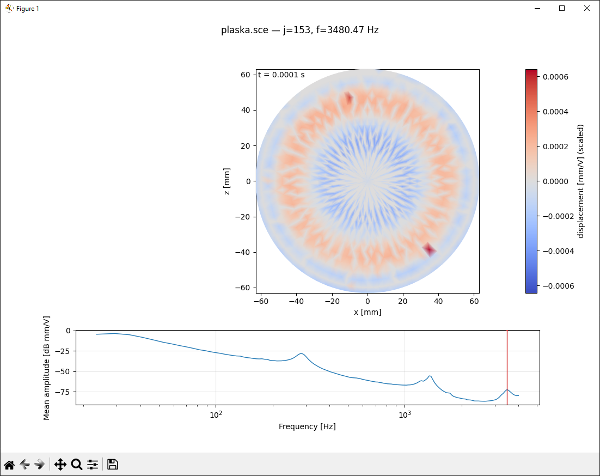

# klippelDataViewer

Note: this repository contains **generated scripts** (created with AI assistance during an interactive Codex CLI session) and may need adjustments for your specific workflow/data.

Tools for parsing and visualizing `*.sce` files (Klippel 3D Scanner).

## Example view

<table>
  <tr>
    <td></td>
    <td></td>
  </tr>
</table>

## Requirements

- Python 3.x
- Packages: `numpy`, `pandas`, `matplotlib`

Install (example):

```powershell
python -m pip install -r requirements.txt
```

## Usage

All usage goes through the `main.py` CLI.

### Animation for a target frequency (nearest by default)

```powershell
python main.py --sce path\to\your_measurement.sce --freq 100
```

### Animation for index `j` (1-based, as stored in the file)

```powershell
python main.py --sce path\to\your_measurement.sce --j 14
```

### Mean amplitude table (quick check)

```powershell
python main.py --sce path\to\your_measurement.sce --mean-only
```

## Interactivity

The animation is shown in 2D (displacement as a colormap on the (x,z) plane).
The matplotlib window is interactive (zoom/pan in the toolbar). Additionally:

- `Space` pauses/resumes the animation (useful for zoom/pan)
- `Esc` / `q` closes the window

## Smoothing

If you have outliers (single points with very different values), you can enable spatial smoothing of the displacement field
(neighbor-based filtering on the triangulation).

Example:

```powershell
python main.py --sce path\to\your_measurement.sce --freq 1400 --smooth 0.3 --smooth-iters 5
```

More robust smoothing for outliers:

```powershell
python main.py --sce path\to\your_measurement.sce --freq 1400 --smooth 0.5 --smooth-iters 5 --smooth-method median
```

Or distance-weighted smoothing (more local):

```powershell
python main.py --sce path\to\your_measurement.sce --freq 1400 --smooth 0.4 --smooth-iters 5 --smooth-method gaussian --smooth-sigma 4
```

## VS Code tasks

Tasks are defined in `.vscode/tasks.json`:

- `Run: animation (prompted)`
- `Run: mean amplitude (prompted)`

Run them via: `Terminal -> Run Task...`.

## Project layout

- `main.py` — CLI entrypoint (recommended way to run the app).
- `animate_membrane.py` — matplotlib animation + mean amplitude plot implementation (invoked by `main.py`).
- `sce_parser.py` — `.sce` parser utilities (geometry, frequency blocks, response blocks).

