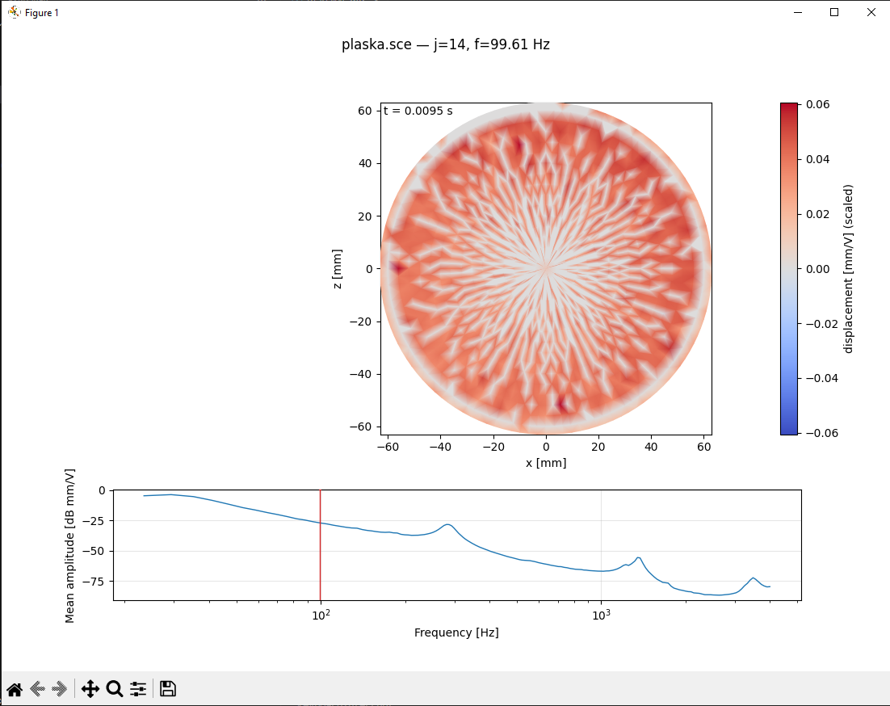

# klippelDataViewer

Note: this repository contains **generated scripts** (created with AI assistance during an interactive Codex CLI session) and may need adjustments for your specific workflow/data.

Tools for parsing and visualizing `*.sce` files (Klippel 3D Scanner).

## Example view



## Files

- `sce_parser.py` — parser library that loads geometry and response (`amp_db`, `phase_rad`) into a `pandas.DataFrame`.
- `animate_membrane.py` — animated membrane view for a chosen frequency + mean amplitude plot at the bottom.
- `main.py` — small “test app” entrypoint to run the animation from CLI.

## Requirements

- Python 3.x
- Packages: `numpy`, `pandas`, `matplotlib`

Install (example):

```powershell
python -m pip install numpy pandas matplotlib
```

## Usage

### Animation for a target frequency (nearest by default)

```powershell
python animate_membrane.py path\to\your_measurement.sce --freq 100
```

### Animation for index `j` (1-based, as stored in the file)

```powershell
python animate_membrane.py path\to\your_measurement.sce --j 14
```

### Test app (`main.py`)

```powershell
python main.py --sce path\to\your_measurement.sce --freq 100
```

## Interactivity

The animation is shown in 2D (displacement as a colormap on the (x,z) plane).
The matplotlib window is interactive (zoom/pan in the toolbar). Additionally:

- `Space` pauses/resumes the animation (useful for zoom/pan)
- `Esc` / `q` closes the window

## Smoothing

If you have outliers (single points with very different values), you can enable spatial smoothing of the displacement field
(neighbor-based filtering on the triangulation).

Example:

```powershell
python main.py --sce path\to\your_measurement.sce --freq 1400 --smooth 0.3 --smooth-iters 5
```

More robust “Klippel-like” smoothing for outliers:

```powershell
python main.py --sce path\to\your_measurement.sce --freq 1400 --smooth 0.5 --smooth-iters 5 --smooth-method median
```

Or distance-weighted smoothing (more local):

```powershell
python main.py --sce path\to\your_measurement.sce --freq 1400 --smooth 0.4 --smooth-iters 5 --smooth-method gaussian --smooth-sigma 4
```

## VS Code tasks

Tasks are defined in `.vscode/tasks.json`:

- `Run: animation (prompted)`
- `Run: mean amplitude (prompted)`

Run them via: `Terminal -> Run Task...`.
