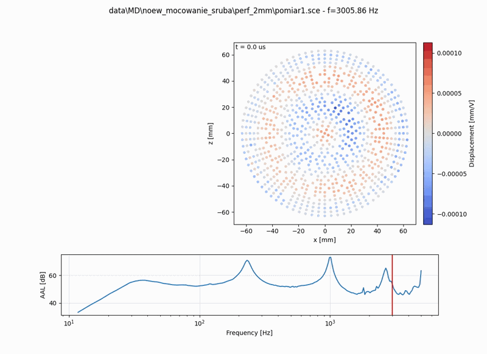
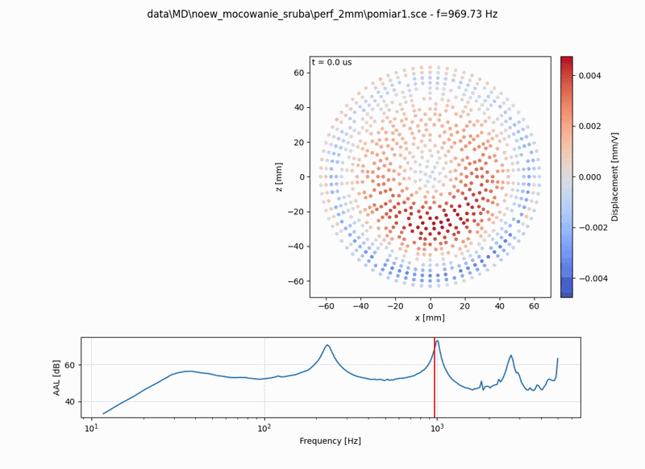

# klippelDataViewer

Note: this repository contains **generated scripts** (created with AI assistance during an interactive Codex CLI session) and may need adjustments for your specific workflow/data.

Tools for parsing and visualizing `*.sce` files (Klippel 3D Scanner).

## Example view

<table>
  <tr>
    <td></td>
    <td></td>
  </tr>
</table>

## Requirements

- Python 3.x
- Packages: `numpy`, `pandas`, `matplotlib`

Setup virtual environment:

```powershell
py -m venv .venv
.venv/Scripts/python -m pip install --upgrade pip 
.venv/Scripts/python -m pip install -r requirements.txt
```

## Usage

All usage goes through the `main.py` CLI.

### Animation

```powershell
.venv/Scripts/python main.py --sce path\to\your_measurement.sce
```

### Calculate Accumulated Acceleration Level table (quick check)

```powershell
.venv/Scripts/python main.py --sce path\to\your_measurement.sce --aal-only
```

## Interactivity

The animation is shown in 2D (displacement as a colormap on the (x,z) plane).

- Click on the bottom AAL plot to pick a new frequency

## VS Code tasks

Tasks are defined in `.vscode/tasks.json`:

- `Setup: Python virtual environment`
- `Run: Animation (.venv)`
- `Run: AAL amplitude (.venv)`

Run them via: `Terminal -> Run Task...`.

## Project layout

- `main.py` — CLI entrypoint.
- `animate_membrane.py` — `MembraneAnimator` + `MembraneModel` (matplotlib animation + AAL plot).
- `sce_parser.py` — `.sce` parser utilities .

